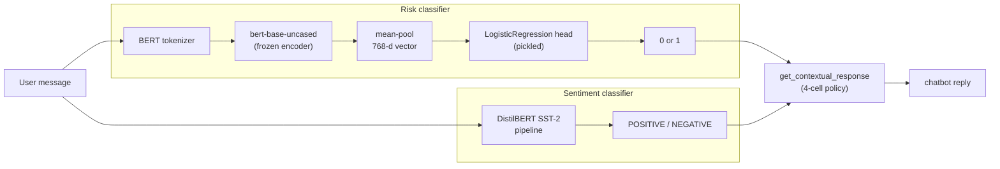

# SameSame Mental Health Chatbot

Experimental work exploring how SameSame could triage user messages by
mental-health risk and adapt the chatbot's response. This repository is the
prototype: a [Chainlit](https://docs.chainlit.io) chatbot that classifies
every incoming message along two axes and picks its reply from a small
response policy.

1. **Risk classification** — a Logistic Regression head over frozen
   `bert-base-uncased` sentence embeddings decides whether the message
   indicates _acute_ mental-health risk (`1`) or not (`0`). Trained on
   SameSame message data.
2. **Sentiment** — HuggingFace's DistilBERT SST-2 pipeline labels the message
   `POSITIVE` / `NEGATIVE`.



The two labels are combined by `get_contextual_response` in `app.py`:

| classification | sentiment  | reply                       |
| -------------- | ---------- | --------------------------- |
| `1`            | `NEGATIVE` | emergency prompt (call 112) |
| `0`            | `NEGATIVE` | offer supportive resources  |
| any            | `POSITIVE` | affirming reply             |
| else           | else       | neutral follow-up           |

> ⚠️ Experimental prototype, not a clinical tool. The `112` emergency number
> is a placeholder — localize it before this reaches real users.

## Repository layout

```
app.py                            # Chainlit app (run this)
logistic_regression_model.pkl     # trained LR head (trained on BERT features)
data_prep.py                      # text-cleaning recipe used to prep training data
requirements.txt
chainlit.md                       # Chainlit welcome screen
SameSameClassification.ipynb      # LR + BERT training / evaluation
UpdatedSameSameClassification.ipynb
prompt_engineering.ipynb          # prompt-engineering and alerting experiments
```

## Setup

Python 3.11 recommended.

```bash
python3 -m venv .venv
source .venv/bin/activate
pip install -r requirements.txt
```

First run will download `bert-base-uncased` (~440 MB) and the DistilBERT
sentiment model (~250 MB) from HuggingFace and cache them under
`~/.cache/huggingface/`.

## Running the chatbot

```bash
chainlit run app.py -h --port 8000
```

Then open http://localhost:8000. Drop `-h` if you want Chainlit to auto-open
the browser.

## Retraining

The pickled LR head was trained inside `SameSameClassification.ipynb` /
`UpdatedSameSameClassification.ipynb`. The training data isn't checked in —
the notebooks expect an Excel file of SameSame chat messages. To retrain
against fresh data:

1. Run `data_prep.py` on the raw Excel export to produce the cleaned CSV
   (strips URLs, demojizes emoji, drops rows with missing text). Needs two
   extra deps not in `requirements.txt`:
   ```bash
   pip install emoji openpyxl
   ```
2. Follow the notebook end-to-end — it will overwrite
   `logistic_regression_model.pkl`.

## Known noisy warnings (safe to ignore)

- `InconsistentVersionWarning` when loading the `.pkl` — the pickle was
  produced with scikit-learn 1.4 and the current requirements install 1.9.
  For a plain `LogisticRegression` the coefficient array loads fine.
- BERT `LOAD REPORT ... UNEXPECTED` entries for `cls.*` keys — expected,
  because the app uses `BertModel` (encoder only) and discards the
  pre-training heads.
